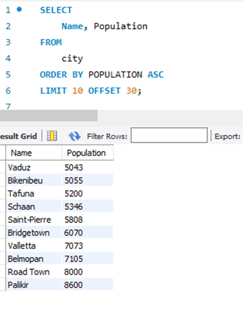

# World Database SQL Queries (MySQL)

## Overview
Practice queries using the **MySQL World Database**, focusing on filtering, sorting, aggregation, pattern matching, and joins.

---

## Tools
- MySQL / MySQL Workbench  
- World Sample Database  

---

## Key Queries & Insights

### Count Cities in USA

```sql
SELECT COUNT(*) AS city_count
FROM city
WHERE CountryCode = 'USA';
 ```

### Life Expectancy Ranking – Global Comparison

```sql
SELECT Name, LifeExpectancy
FROM country
ORDER BY LifeExpectancy DESC
LIMIT 1;
 ```

Insight
Identifies the highest life expectancy value in the dataset.


### City Name Pattern Analysis – "New"
```sql
City Name Pattern Analysis – "New"
SELECT Name
FROM city
WHERE Name LIKE '%New%';
 ```
Insight
Demonstrates string pattern filtering across city names.


### Population Leaders – Top Cities

```sql
SELECT Name, Population
FROM city
ORDER BY Population DESC
LIMIT 10;
```

Insight
Highlights global population concentration among major cities.

### High-Population Urban Centres
```sql
SELECT Name, Population
FROM city
WHERE Population > 2000000
ORDER BY Population DESC;
```

Insight
Filters for cities with large population sizes.

### Prefix-Based City Filtering – "Be"
```sql
SELECT Name
FROM city
WHERE Name LIKE 'Be%';
```

Insight
Illustrates prefix filtering using pattern matching.

### Mid-Sized City Population Segment
```sql
SELECT Name, Population
FROM city
WHERE Population BETWEEN 500000 AND 1000000
ORDER BY Population DESC;
```

Insight
Identifies cities within a defined population range.

### Alphabetical Ordering – City Names

```sql
SELECT Name
FROM city
ORDER BY Name ASC;
```

Insight
Useful for lookup, presentation, and indexing scenarios.

### Maximum Population City
```sql
SELECT Name, Population
FROM city
ORDER BY Population DESC
LIMIT 1;
```

Insight
Reveals the most populated city in the dataset.

### City Frequency by Country
```sql
SELECT CountryCode, COUNT(*) AS city_count
FROM city
GROUP BY CountryCode;
```

Insight
Shows distribution of city records across countries.

### Minimum Population City
```sql
SELECT Name, Population
FROM city
ORDER BY Population ASC
LIMIT 1;
```

Insight
Identifies the lowest population value recorded.

### Largest Country by Population
```sql
SELECT Name, Population
FROM country
ORDER BY Population DESC
LIMIT 1;
```

Insight
Highlights the highest population country in the dataset.

### Capital Lookup – Spain
```sql
SELECT *
FROM city
WHERE CountryCode = 'ESP'
ORDER BY ID ASC
LIMIT 1;
```

Insight
Retrieves Spain’s capital city record.

### European Countries & Capitals (Join Example)
```sql
SELECT country.Name, city.Name, city.Population
FROM country
INNER JOIN city ON city.ID = country.Capital
WHERE Continent = 'Europe';
```

Insight
Combines country and capital city attributes via relational join.

### Average Population by Region
```sql
SELECT Region, AVG(Population) AS AvgPopulation
FROM country
GROUP BY Region
ORDER BY AvgPopulation DESC;
```

Insight
Compares population levels across regions.

### Capital City Population Comparison
```sql
SELECT city.Name, city.Population, country.Name
FROM country
INNER JOIN city ON city.ID = country.Capital
ORDER BY city.Population DESC;
```

Insight
Supports comparison of capital city population sizes.

### Population Ranking – Rows 31–40
```sql
SELECT Name, Population
FROM city
ORDER BY Population DESC
LIMIT 10 OFFSET 30;
```


Insight
Demonstrates pagination using LIMIT and OFFSET.

